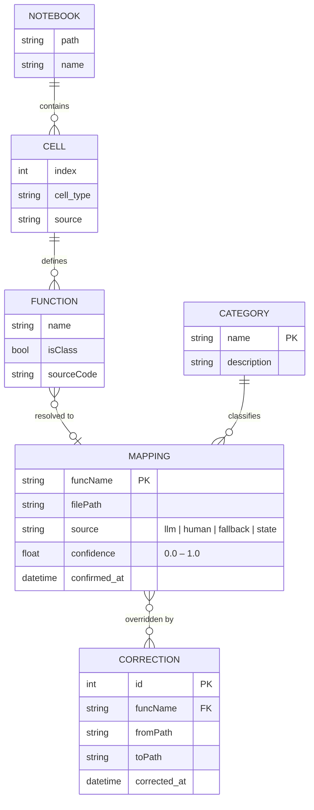
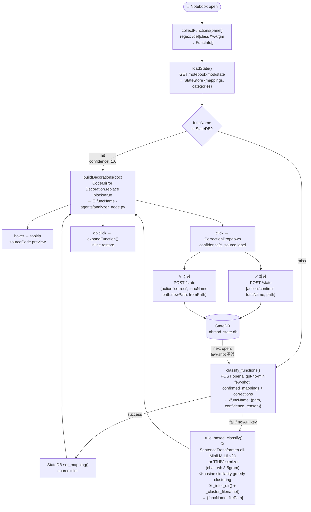
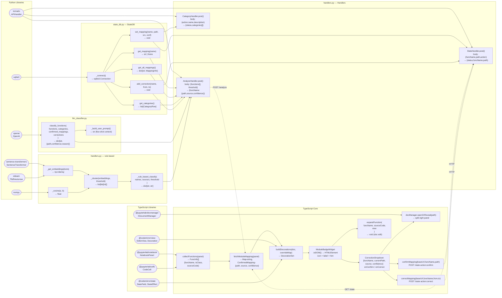

# NoteBook_MOD — Architecture

> Mermaid diagrams render natively on GitHub. Three views: data model → classification pipeline → library/function/variable dependency.

---

## 1. Data Model (ERD)

StateDB에 저장되는 엔티티와 노트북 개념 모델 간 관계.

---

## 2. Classification Pipeline (3-tier)

노트북 오픈 → 뱃지 렌더링 → 사용자 수정 → StateDB 플라이휠.

---

## 3. Library → Function → Variable Dependency

외부 라이브러리가 어느 함수에서 쓰이고, 무슨 변수/타입을 만들어내는지.

---

## Route Map

| Method | Endpoint | Handler | Key variables |
|--------|----------|---------|---------------|
| `GET`  | `/notebook-mod/analyze` | `AnalyzeHandler.get` | `backend: "openai" \| "sentence-transformers" \| "tfidf-fallback"` |
| `POST` | `/notebook-mod/analyze` | `AnalyzeHandler.post` | `functions[], threshold` → `{funcName:{path,source,confidence}}` |
| `GET`  | `/notebook-mod/state` | `StateHandler.get` | → `{mappings{}, categories[], corrections[]}` |
| `POST` | `/notebook-mod/state` | `StateHandler.post` | `{funcName, path, action:"confirm"\|"correct", fromPath?}` |
| `GET`  | `/notebook-mod/categories` | `CategoryHandler.get` | → `{categories[]}` |
| `POST` | `/notebook-mod/categories` | `CategoryHandler.post` | `{action:"add"\|"delete", name, description?}` |
